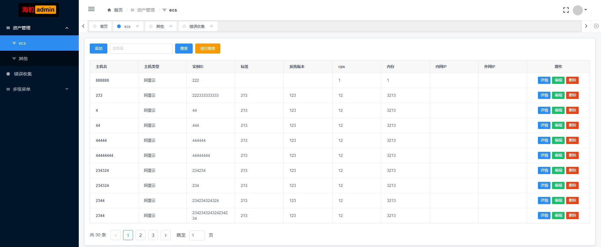
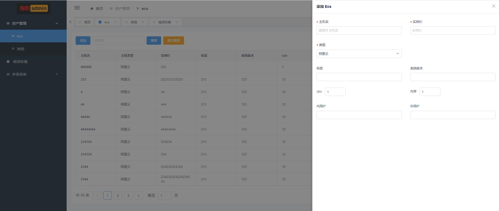
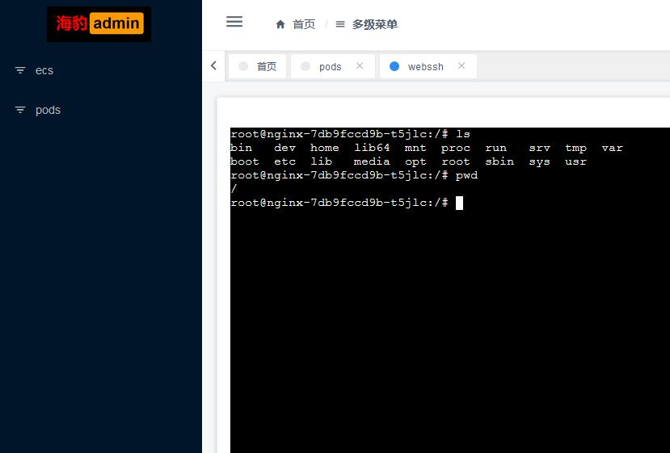

[简体中文](README.md) | [English](README.en.md)

# seal-vue 海豹前端


> **⚠️ 本项目已停止开发！** 因长时间未对代码进行维护，可能会造成项目在不同环境上无法部署、运行 BUG 等问题，请知晓！项目仅供参考！

> seal（海豹）项目的 Vue 版本前端，基于 [iview-admin](https://github.com/iview/iview-admin) 2.5.0 二次开发，后端为 [seal](https://github.com/hequan2017/seal)。

## 项目介绍

seal 是一个 Django 基础开发平台模板，同时支持非前后端分离和前后端分离两种开发模式。seal-vue 是它配套的前后端分离前端：登录后菜单由后端动态下发，内置资产管理（ECS）增删改查页面和 K8s Pod WebSSH 网页终端，也可以作为 iView + Vue 开发运维管理界面的参考模板。

## ✨ 功能特性

- 登录认证：对接后端 `/api/token` 接口获取 Token，存入 Cookie，支持退出登录
- 动态菜单：登录后请求后端 `system/menu` 接口获取菜单数据，前端动态生成路由与侧边栏
- 资产管理：ECS 资产的列表、新建、编辑、删除（对接 `/assets/api/ecs` 接口）
- K8s Pod WebSSH：基于 xterm.js + WebSocket，输入 Pod 名称与命名空间即可在浏览器中打开终端（对接 `/ws/{pod}/{namespace}`）
- 继承 iview-admin 2.5.0 完整框架能力：多标签页、面包屑、权限指令、错误日志收集等开箱即用

## 🛠 技术栈

- Vue 2.5 + Vue Router + Vuex，vue-cli 3 构建
- UI：iView 3.4（iview-admin 2.5.0 模板）
- 网络请求 axios 0.18，Web 终端 xterm 3.14，图表 echarts 4

## 🚀 快速开始

```bash
# 克隆项目
git clone https://github.com/hequan2017/seal-vue.git
cd seal-vue

# 安装依赖
npm install

# 本地开发
npm run dev

# 打包（输出 dist 目录）
npm run build
```

- 后端接口地址在 `src/config/index.js` 的 `baseUrl` 中配置：`dev`（测试）、`pro`（线上）
- 使用前需先部署好后端 [seal](https://github.com/hequan2017/seal)

## 📸 演示

> DEMO：<http://129.28.156.219:8004/home>（账户 admin / 密码 1qaz.2wsx）





## 🔗 相关项目

- 后端：[seal](https://github.com/hequan2017/seal)
- 另一版前端（D2Admin / Element UI）：[seal-d2-admin](https://github.com/hequan2017/seal-d2-admin)

## 📄 许可证

[MIT](http://opensource.org/licenses/MIT)

## 作者

> 何全
